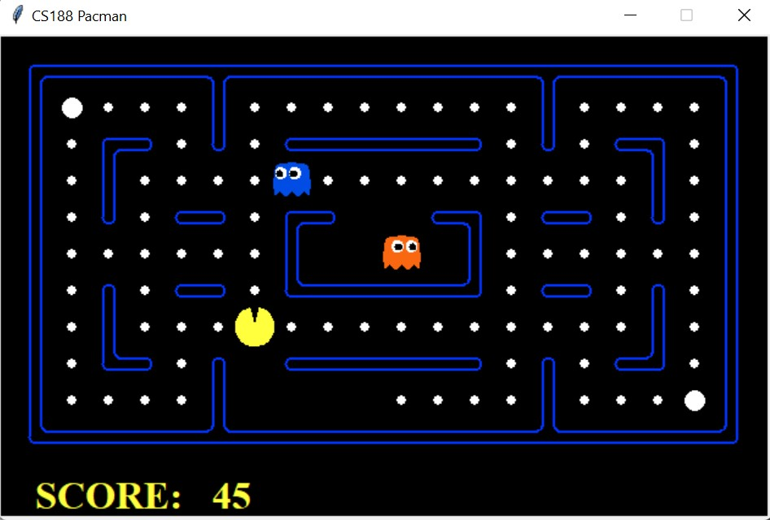

## Pacman-AI

In this project, we will solve Pac-man game using algorithms: MiniMax, Alpha-Beta pruning and Expectimax.

### 1. Set up environment

```
pip install pygame
pip install pyautogui
```
### 2. How to run game
#### 2.1 Git clone source code
```
git clone https://github.com/UIT-20521888/Pacman-AI.git
cd Pacman-AI
```
2.2 Run game

To run this pacman code we can use the following:
- Self-interactive control:
```
python pacman.py
```
- Manually interact the control with an optional layout file (using the additional -l flag):

    For example:
```
python pacman.py -l trickyClassic
```
- Ask to run a certain algorithm (using the -p flag):

    For example:
```
python pacman.py -l mediumClassic -p ExpectimaxAgent
```
- Ask to run some algorithm with the desired number of floors  in the game tree (number of forward looking steps) and use some price function:
    For example:
```
python pacman.py -l mediumClassic -p MinimaxAgent -a depth=3,evalFn=betterEvaluationFunction
```
- Each time the program runs, a different random seed will be used. The random seed can be fixed for easy debugging by using the -f flag. 
    For example:
```
python pacman.py -l mediumClassic -p MinimaxAgent -a depth=3,evalFn=betterEvaluationFunction -f
```
Where: 
- All possible layouts in the game [here](./layouts/)
- The algorithms available in the game is: "MiniMax", "Alpha-Beta" and "Expectimax"
- Evaluation Functions available in image is "EvaluationFunctionMe"

--------------------------------
After running the game, the following screen will be displayed:


For example:

<video height="264" controls> <source src="./images/game.mov" type="video/mp4"> </video>
